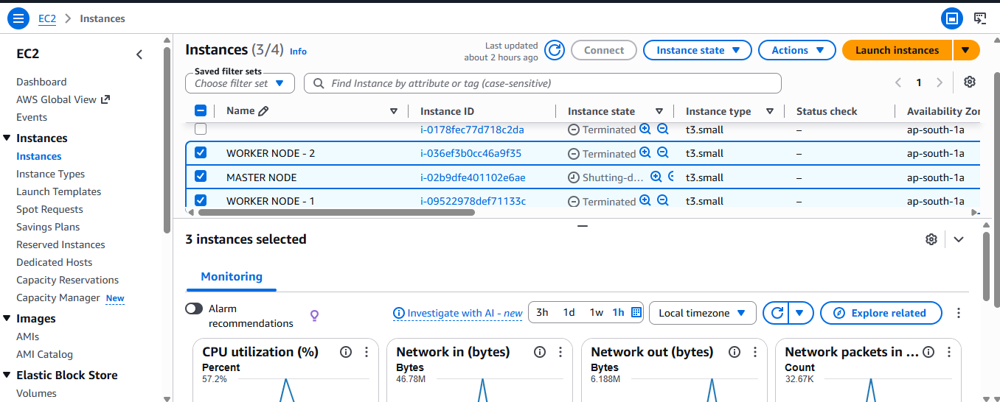
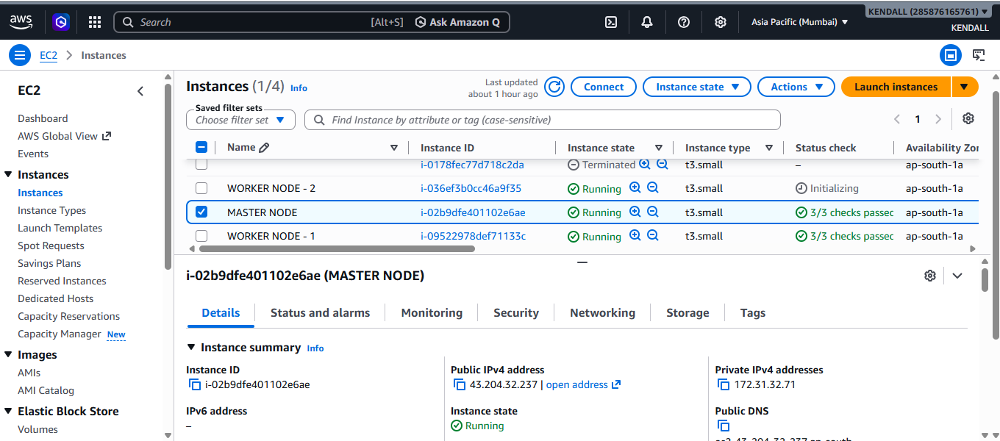
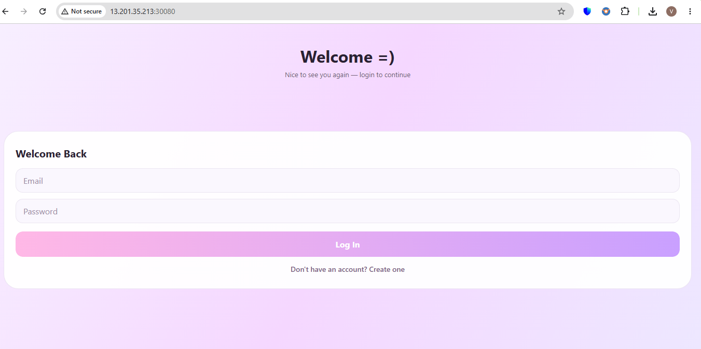
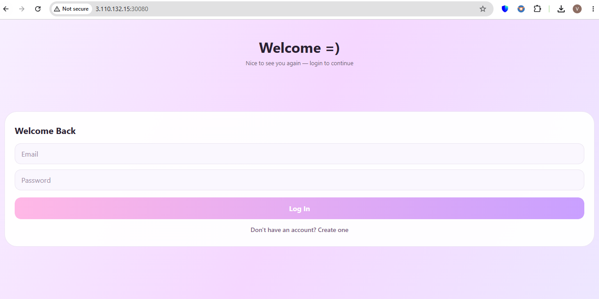
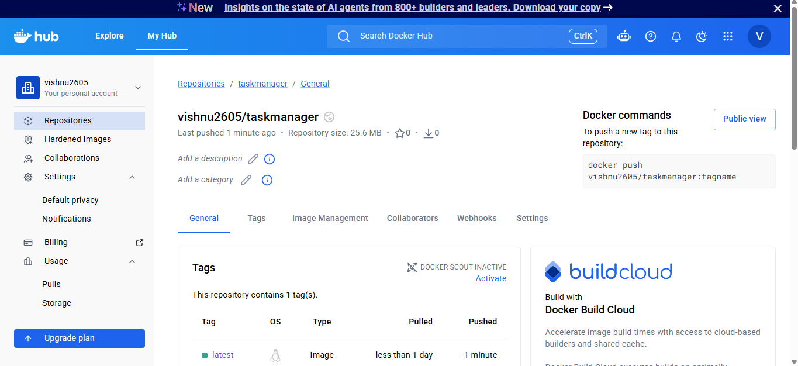

# Kubernetes Multi-Node Cluster Deployment on AWS

## Project Overview

This project demonstrates the deployment of a Kubernetes cluster on AWS EC2 instances using **Kubeadm**, consisting of:

* 1 Master Node (Control Plane)
* 2 Worker Nodes
* Docker Installation Automation
* Kubernetes Cluster Setup Automation
* Application Deployment using Kubernetes YAML Manifests
* Service Exposure using Kubernetes Service

The entire cluster setup is automated through shell scripts, making it easy to provision and deploy applications in a Kubernetes environment.

---

# Architecture

```text
                    +----------------------+
                    |     Master Node      |
                    |   Control Plane      |
                    +----------+-----------+
                               |
              ---------------------------------------
              |                                     |
    +---------+---------+               +-----------+---------+
    |   Worker Node 1   |               |   Worker Node 2    |
    |      Docker       |               |      Docker        |
    |     Kubelet       |               |      Kubelet       |
    +-------------------+               +--------------------+

                   Application Pods Running
```

---

# Technologies Used

* AWS EC2
* Docker
* Kubernetes
* Kubeadm
* Kubectl
* Kubelet
* Linux (Ubuntu)
* Bash Scripting

---

# Project Structure

```text
Kubernetes-Project/
│
├── docker-install.sh
├── master-node-setup.sh
├── worker-node-setup.sh
│
├── deployment.yaml
├── service.yaml
│
├── DOCKER-IMAGE-OUTPUT.png
├── MASTER NODE.png
├── MASTER-NODE-SERVER.png
├── SERVERS.png
├── WORKER NODE-1 SERVER.png
├── WORKER NODE-2 SERVER.png
├── WORKER-NODE-OUTPUT-1.png
├── WORKER-NODE-OUTPUT-2.png
│
└── README.md
```

---

# Infrastructure Details

| Component              | Configuration  |
| ---------------------- | -------------- |
| Master Node            | 1 EC2 Instance |
| Worker Node 1          | 1 EC2 Instance |
| Worker Node 2          | 1 EC2 Instance |
| Container Runtime      | Docker         |
| Orchestration Platform | Kubernetes     |
| Cluster Bootstrap Tool | Kubeadm        |

---

# Setup Instructions

## Step 1: Clone Repository

```bash
git clone https://github.com/Vishnu1805/Kubernetes-Project.git

cd Kubernetes-Project
```

---

## Step 2: Provide Execute Permissions

```bash
sudo chmod +x docker-install.sh
sudo chmod +x master-node-setup.sh
sudo chmod +x worker-node-setup.sh
```

or

```bash
sudo chmod +x *.sh
```

---

## Step 3: Install Docker

Run on Master and Worker Nodes:

```bash
sudo ./docker-install.sh
```

Verify Docker Installation:

```bash
docker --version
```

---

## Step 4: Configure Kubernetes Master Node

Execute on Master Node:

```bash
sudo ./master-node-setup.sh
```

Verify:

```bash
kubectl get nodes
```

Expected Output:

```bash
NAME          STATUS   ROLES           AGE
master-node   Ready    control-plane   XXm
```

---

## Step 5: Configure Worker Nodes

Execute on Worker Nodes:

```bash
sudo ./worker-node-setup.sh
```

Join command generated from Master Node:

```bash
sudo kubeadm join <MASTER-IP>:6443 \
--token <TOKEN> \
--discovery-token-ca-cert-hash sha256:<HASH>
```

---

## Step 6: Verify Cluster

From Master Node:

```bash
kubectl get nodes
```

Expected Output:

```bash
NAME            STATUS   ROLES
master-node     Ready    control-plane
worker-node-1   Ready    <none>
worker-node-2   Ready    <none>
```

---

# Application Deployment

Deploy Kubernetes resources:

## Create Deployment

```bash
kubectl apply -f deployment.yaml
```

Verify Deployment:

```bash
kubectl get deployments
```

Verify Pods:

```bash
kubectl get pods -o wide
```

---

## Create Service

```bash
kubectl apply -f service.yaml
```

Verify Service:

```bash
kubectl get svc
```

---

## Deploy Everything

```bash
kubectl apply -f .
```

---

# Validation Commands

## View Nodes

```bash
kubectl get nodes
```

## View Pods

```bash
kubectl get pods
```

## View Services

```bash
kubectl get svc
```

## View Deployments

```bash
kubectl get deployments
```

## Describe Pod

```bash
kubectl describe pod <pod-name>
```

## View Logs

```bash
kubectl logs <pod-name>
```

---

# Troubleshooting

### Generate New Join Command

```bash
kubeadm token create --print-join-command
```

### Check Cluster Information

```bash
kubectl cluster-info
```

### Restart Kubelet

```bash
sudo systemctl restart kubelet
```

### Check Node Status

```bash
kubectl get nodes
```

---

# Screenshots

## AWS EC2 Servers



---

## Master Node Server



---

## Worker Node 1 Server


---

## Worker Node 2 Server


---

## Master Node Configuration Output


---

## Worker Node 1 Join Output



---

## Worker Node 2 Join Output



---

## Docker Installation Output



---
